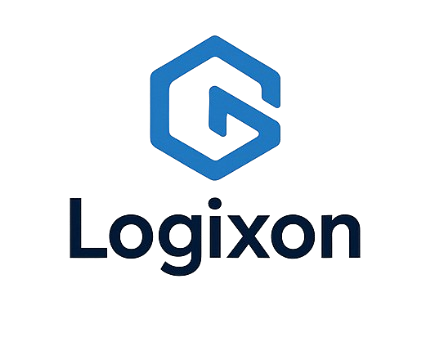

# Logixon

**Logixon** is a dynamic and modular rule-based engine designed to automate decision-making based on user-defined triggers and actions.

> ⚠️ **Note:** This project is under development and **should be refactored** for improved structure, maintainability, and performance.

---

## 🚀 Features

- 📦 JSON-based rule and action definition
- 🔄 Trigger-based condition evaluation
- ✅ Active/inactive rule support
- 🛠️ Modular architecture (Controller, Repository, Validator)
- 📚 Sequelize ORM with PostgreSQL support

---


## 📦 Technologies

- Node.js
- Express.js (or Router)
- PostgreSQL
- Sequelize
- Joi
- JWT
- md5
- debezium

---

## 🧪 Getting Started

1. Clone the repo:

```bash
git clone https://github.com/yourusername/logixon.git
cd logixon
```

2. Install dependencies:

```bash
npm install
```

3. Configure your `.env` file for database connection.

4. Run the development server:

```bash
npm run dev
```

---

## 🧹 To Do (Refactor Plan)

- [ ] Restructure validators into per-entity files
- [ ] Apply DRY principles in controllers
- [ ] Add middleware for consistent error handling
- [ ] Improve logging and exception tracking
- [ ] Add unit tests for all services

---

## 🤝 Contributing

PRs are welcome! Please open an issue to discuss major changes beforehand.

---